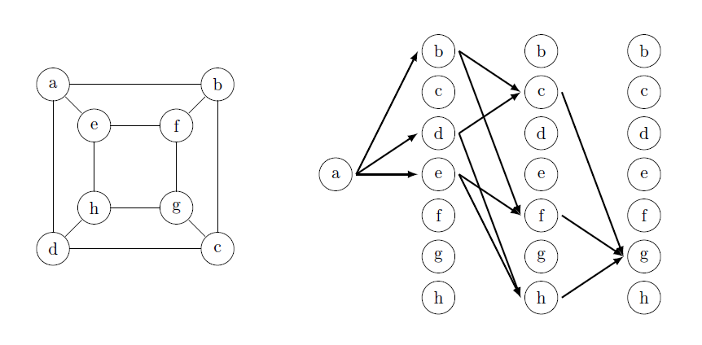

# Graph isomorphism

This package have two basic functions:

1. The `test_isomophism()` function can be used to test graphs for isomorphism. Outputs `True` or `False`.

2. The `find_isomophism()` function can be used to find set of isomorphic vertices for each vertex of the graph. For non-symmetric graphs, outputs isomorphism substitution.

Runtime depends polynomially on the number of vertices. In the first case the complexity of the algorithm is $O(n^4)$, in the second case it is $O(n^5)$.

Multigraphs and directed graphs are not supported.

The module has been tested to work on Python 3.11.5.

# Usage

Run examples.py for usage in an interactive session.

```python
>>> g1 = {'1': ['2'],'2': ['1','3'], '3': ['2']}
>>> g2 = {'a': ['b','c'],'b': ['a','c'], 'c': ['a','b'],}
>>> example = Graph(g1,g2)
>>> example.test_isomophism()
False
>>> example3().graph1
{'1': ['2', '3'],
 '2': ['1', '3', '4', '5'],
 '3': ['1', '2', '4', '5'],
 '4': ['2', '3', '5'],
 '5': ['2', '3', '4']}
>>> example3().graph2
{'a': ['b','c'],
 'b': ['a','c','d','e'],
 'c': ['a','b','d','e'],
 'd': ['b','c','e'],
 'e': ['b','c','d']}
>>> example3().test_isomophism()
True
>>> example3().find_isomophism()
[('1', 'a'),
 ('2', {'b', 'c'}),
 ('3', {'b', 'c'}),
 ('4', {'d', 'e'}),
 ('5', {'d', 'e'})]
>>>
```

# Basic concepts
## Virtual neural network

We illustrate the main idea of this design with the following example. 
Let's build a virtual neural network for grid 3x3. 
We choose (0,0) and (2,0) as the initial and final coordinates, respectively.
Such the network contains information about all possible paths from point (0,0) to point (2,0) in eight unit steps.
The construction is carried out on both sides, which eliminates the formation of dead-end paths.
For the grid we will have the complexity $O(n^{2.1})$.
In general, the complexity will not exceed $O(n^3)$.

```python
>>> example6().virtual_network(example6().graph1, (0,0), (2,0))
[{(0, 0): [(1, 0), (0, 1)]},
 {(1, 0): [(1, 1)], (0, 1): [(1, 1), (0, 2)]},
 {(1, 1): [(2, 1), (0, 1), (1, 2), (1, 0)], (0, 2): [(1, 2), (0, 1)]},
 {(2, 1): [(1, 1), (2, 2)],
  (0, 1): [(1, 1), (0, 2)],
  (1, 2): [(2, 2), (0, 2), (1, 1)],
  (1, 0): [(1, 1)]},
 {(1, 1): [(2, 1), (0, 1), (1, 2), (1, 0)],
  (2, 2): [(2, 1), (1, 2)],
  (0, 2): [(0, 1), (1, 2)]},
 {(2, 1): [(1, 1), (2, 2)],
  (0, 1): [(1, 1)],
  (1, 2): [(1, 1), (2, 2)],
  (1, 0): [(1, 1)]},
 {(1, 1): [(1, 0), (2, 1)], (2, 2): [(2, 1)]},
 {(1, 0): [(2, 0)], (2, 1): [(2, 0)]}]
>>>
```


## Virtual neural network derivative

Derivative of Virtual neural network is called network that is constructed as follows:
1. Sets are sought between two adjacent layers, which consist of the number of connections that each neuron forms.
2. It is determined how many connections each neuron generates in the next layer.

Two graphs are isomorphic if and only if the derivatives of their virtual neural networks constructed from the same vertex coincide.

As an example, consider two partially specified virtual neural networks and its derivative.

```python
>>> network1 = example7().partical_network(example7().graph1,'a',None,3)
>>> example7().network_derivative(network1)
[[(2, [1, 2])],[(1, [2]), (2, [1, 2])]]
>>> network2 = example7().partical_network(example7().graph2,'i',None,3)
>>> example7().network_derivative(network2)
[[(2, [1, 2])],[(1, [1]), (2, [2, 2])]]
>>>
```


## Virtual neural network with reversed

The construction of a network of this type is carried out on one side. This is done according to two rules:
1. Before new connections are formed, a reverse network is built for each neuron in each layer.
2. The formation of a new connection is prohibited if the new neuron is contained in the reverse network.

This approach allows you to significantly reduce the size of the network
($2\sqrt{n}-1$ layers in the best case and $n$ layers in the worst case where $n$ is the number of graph vertices).

As an example, let's build such a network for a cube.

```python
>>> cube().network_with_reversed(cube().graph1,'a')
[{'a': ['b', 'd', 'e']},
 {'e': ['f', 'h'], 
  'd': ['c', 'h'],
  'b': ['c', 'f']},
 {'f': ['g'], 
  'h': ['g'], 
  'c': ['g']}]
>>>
```


