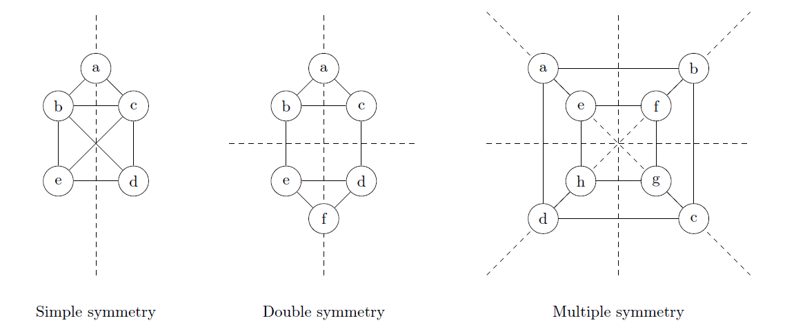
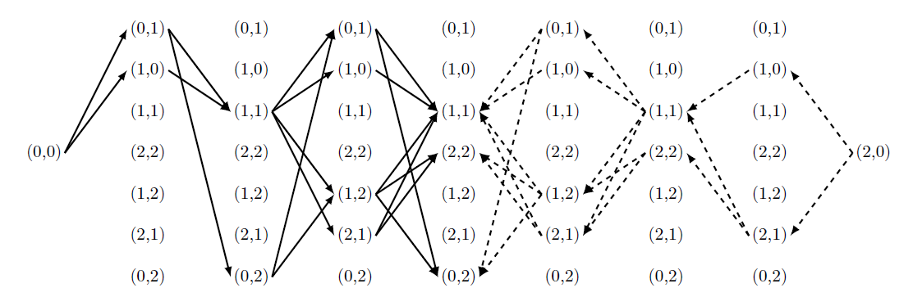
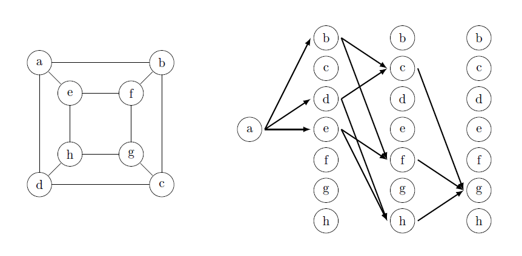
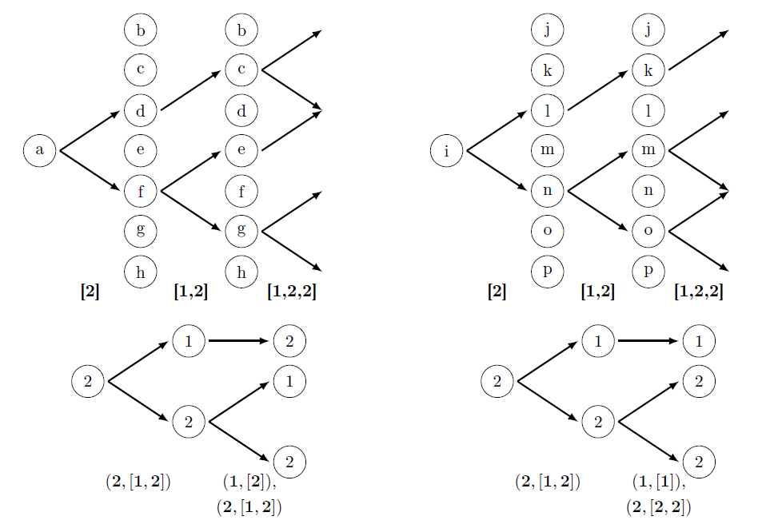

⚠️ Coming soon: a major update with architecture improvements and a fast Python + Numba (CSR + njit) version for large graphs, along with large‑scale algorithm testing.

# Isomorphism Testing Results for Connected Graphs

Connected graphs from the [BDM collection](https://users.cecs.anu.edu.au/~bdm/data/graphs.html) (Brendan McKay) were tested.  
All graphs in a set are pairwise non-isomorphic. Before testing, graphs were grouped by trivial invariants:  
- number of vertices  
- number of edges  
- degree sequence

**False positive pair** – a pair of graphs for which the algorithm incorrectly determines isomorphism on at least one pair of vertices. For each pair of graphs, all vertex pairs are checked.

The table includes sets:
- `ge*` – graphs with a fixed number of edges (8 to 13);
- `graph*` – graphs with a fixed number of vertices (6 to 9).

For sets with **12 or fewer edges** and **8 or fewer vertices**, no false positives were recorded.

## Graphs with a Fixed Number of Edges

| File | Total pairs | Inv1 | Inv2 | Inv3 | False positives | % false positives | 
|------|-------------|----------------|-------------------|------|------|------|
| ge9c.g6 | 6 055 | 6 028 | 27 | 0 | 0 | 0.0000% |
| ge10c.g6 | 52 148 | 51 953 | 192 | 3 | 0 | 0.0000% |
| ge11c.g6 | 498 917 | 497 864 | 1 216 | 27 | 0 | 0.0000% |
| ge12c.g6 | 5 311 679 | 5 304 142 | 7 328 | 209 | 0 | 0.0000% |
| ge13c.g6 | 62 412 197 | no data | no data | no data | no data | — |
| ge14c.g6 | 805 017 968 | no data | no data | no data | no data | — |
| ge15c.g6 | 11 326 565 644 | no data | no data | no data | no data | — |

## Graphs with a Fixed Number of Vertices

| File | Total pairs | Inv1 | Inv2 | Inv3 | False positives | % false positives |
|------|-------------|----------------|-------------------|------|------|------|
| graph6c.g6 | 75 | 75 | 0 | 0 | 0 | 0.0000% |
| graph7c.g6 | 3 038 | 3 024 | 14 | 10 | 0 | 0.0000% |
| graph8c.g6 | 293 364 | 291 901 | 1 031 | 432 | 0 | 0.0000% |
| graph9c.g6 | 90 277 837 | no data | no data | no data | no data | — |

## Strongly Regular Graphs

| Type | Total pairs | Inv1 | Inv2 | Inv3 | False positives | % false positives |
|------|-------------|----------------|-------------------|------|------|------|
|SRG(25,12,5,6)|105|0|0|105|0|0.0000%|
|SRG(26,10,3,4)|45|0|1|14|0|0.0000%|
|SRG(28,12,6,4)|6|0|0|6|0|0.0000%|
|SRG(29,14,6,7)|820|no data|no data|no data|0|0.0000%|
|SRG(35,16,6,8)|7 424 731|no data|—|
|SRG(35,18,9,9)|25 651|no data|—|
|SRG(36,14,4,6)|16 110|0|0.0000%|
|SRG(36,15,6,6)|529 669 878|no data|—|
|SRG(37,18,8,9) some|22 845 420|no data|—|
|SRG(40,12,2,4)|378|0|0.0000%|
|SRG(65,32,15,16) some|496|0|0.0000%|

# Graph Isomorphism

This package have two basic functions:

1. The `test_is_ismorphic()` function can be used to test graphs for isomorphism. Outputs `True` or `False`.

2. The `test_find_orbits()` function can be used to find set of isomorphic vertices for each vertex of the graph. For non-symmetric graphs, outputs isomorphism substitution.

Runtime depends polynomially on the number of vertices and edges. In the first case the complexity of the algorithm is $O(|V|\cdot(|V|+|E|))$, in the second case it is $O(|V|^{2}\cdot(|V|+|E|))$, where $|V|$ is the number of vertices and $|E|$ is the number of edges in the graph.

Only undirected сonnected graphs.

The module has been tested to work on Python 3.12.7.

# Usage

Run examples.py for usage in an interactive session.

```python
>>> g1 = {'1': ['2'],'2': ['1','3'], '3': ['2']}
>>> g2 = {'a': ['b','c'],'b': ['a','c'], 'c': ['a','b']}
>>> example = Graph(g1,g2)
>>> example.test_is_ismorphic()
False
>>> example1().graph1
{'1': ['2', '3'],
 '2': ['1', '3', '4', '5'],
 '3': ['1', '2', '4', '5'],
 '4': ['2', '3', '5'],
 '5': ['2', '3', '4']}
>>> example1().graph2
{'a': ['b','c'],
 'b': ['a','c','d','e'],
 'c': ['a','b','d','e'],
 'd': ['b','c','e'],
 'e': ['b','c','d']}
>>> example1().test_is_ismorphic()
True
>>> example1().test_find_orbits()
[('1', 'a'),
 ('2', {'b', 'c'}),
 ('3', {'b', 'c'}),
 ('4', {'d', 'e'}),
 ('5', {'d', 'e'})]
>>>
```

# Symmetry in Graphs and Automorfism

Symmetry in graphs can be divided into three types:
1. Simple (bilateral) symmetry. The graph has one axis of symmetry. The order of the automorphism group is $\ge2$.
2. k-fold (double, triple, etc.) symmetry. The graph has k axes of symmetry. The order of the automorphism group is $\ge2\cdot k$.
3. Multiple symmetry. All vertices of the graph are isomorphic to each other and lie on one of the axes of symmetry. The order of the automorphism group is $\ge2\cdot|V|$, where $|V|$ is the number of vertices of the graph.



The `find_automorphism()` function can be used to find arbitary automorphism substitution for any symmetry type.

```python
>>> orb = example2().test_find_orbits()
>>> example2().find_automorphism(orb)
[('a', 'b', 'c', 'd', 'e', 'f'),
 ('f~', 'd~', 'e~', 'b~', 'c~', 'a~')]
>>>
```

# Basic Concepts
## Graph Virtual Neural Network

Graph virtual neural network (GVN) is a network focused on working with graphs. In networks of this type, the vertices of the graph are called neurons and the edges of the graph are called synaptic connections. This type of network can be one-way or two-way.

We illustrate the main idea of this design with the following example. 
Let's build two-way virtual neural network for grid 3x3. 
We choose (0,0) and (2,0) as the initial and final coordinates, respectively.
Such the network contains information about all possible paths from point (0,0) to point (2,0) in eight unit steps.
The construction is carried out on both sides, which eliminates the formation of dead-end paths.
For the grid we will have the complexity $O(|V|^{2.1})$.
In general, the complexity will not exceed $O(|V|^3)$.

```python
>>> Graph.twoway_network(example6().graph1, (0,0), (2,0))
[{(0, 0): [(1, 0), (0, 1)]},
 {(1, 0): [(1, 1)], (0, 1): [(1, 1), (0, 2)]},
 {(1, 1): [(2, 1), (0, 1), (1, 2), (1, 0)], (0, 2): [(1, 2), (0, 1)]},
 {(2, 1): [(1, 1), (2, 2)],
  (0, 1): [(1, 1), (0, 2)],
  (1, 2): [(2, 2), (0, 2), (1, 1)],
  (1, 0): [(1, 1)]},
 {(1, 1): [(2, 1), (0, 1), (1, 2), (1, 0)],
  (2, 2): [(2, 1), (1, 2)],
  (0, 2): [(0, 1), (1, 2)]},
 {(2, 1): [(1, 1), (2, 2)],
  (0, 1): [(1, 1)],
  (1, 2): [(1, 1), (2, 2)],
  (1, 0): [(1, 1)]},
 {(1, 1): [(1, 0), (2, 1)], (2, 2): [(2, 1)]},
 {(1, 0): [(2, 0)], (2, 1): [(2, 0)]}]
>>>
```



## Minimal One-Way Graph Virtual Neural Network

When constructing each layer in a network of this type, the edges traversed in all previous layers are not used. However, the same edge can be traversed in both directions in each layer. This is necessary in order to preserve information about the symmetry of the graph. It allows us to significantly speed up the testing of graphs for isomorphism and finding graph vertices orbits. The time complexity is $O(|V|+|E|)$.

```python
>>> Graph.minimal_oneway_network(cube().graph1,'a')
[{'a': ['b', 'd', 'e']},
 {'b': ['c', 'f'], 'd': ['c', 'h'], 'e': ['f', 'h']},
 {'c': ['g'], 'f': ['g'], 'h': ['g']}]
>>> cube().test_is_ismorphic()
True
>>> iso = cube().test_find_orbits()
>>> cube().find_automorphism(iso)
[('a', 'b', 'c', 'd', 'e', 'f', 'g', 'h'),
('e~', 'f~', 'g~', 'h~', 'a~', 'b~', 'c~', 'd~')]
```



# GVN invariants

⚠️ This section will be revised and expanded.

## Matrix Indegrees and Outdegrees

One of the key concepts of GVN is the matrix indegrees and outdegrees. Each row in this matrix corresponds to its own vertex. Furthermore, its rows do not have a fixed association with indices.

```python
>>>
network = Graph.twoway_network(example6().graph1, (0,0), (2,0))
Graph.get_degree_matrix(example6().graph1,network)
{(0, 0): ([0, 0, 0, 0, 0, 0, 0, 0, 0], [2, 0, 0, 0, 0, 0, 0, 0, 0]),
 (0, 1): ([0, 1, 0, 2, 0, 2, 0, 0, 0], [0, 2, 0, 2, 0, 1, 0, 0, 0]),
 (0, 2): ([0, 0, 1, 0, 2, 0, 0, 0, 0], [0, 0, 2, 0, 2, 0, 0, 0, 0]),
 (1, 0): ([0, 1, 0, 1, 0, 1, 0, 1, 0], [0, 1, 0, 1, 0, 1, 0, 1, 0]),
 (1, 1): ([0, 0, 2, 0, 4, 0, 4, 0, 0], [0, 0, 4, 0, 4, 0, 2, 0, 0]),
 (1, 2): ([0, 0, 0, 2, 0, 3, 0, 0, 0], [0, 0, 0, 3, 0, 2, 0, 0, 0]),
 (2, 0): ([0, 0, 0, 0, 0, 0, 0, 0, 2], [0, 0, 0, 0, 0, 0, 0, 0, 0]),
 (2, 1): ([0, 0, 0, 1, 0, 2, 0, 2, 0], [0, 0, 0, 2, 0, 2, 0, 1, 0]),
 (2, 2): ([0, 0, 0, 0, 2, 0, 2, 0, 0], [0, 0, 0, 0, 2, 0, 1, 0, 0])}
>>>
```

The function `get_degree_dict` optimizes the storage of matrix indegrees and outdegrees while requiring the minimum possible RAM. Non‑zero pairs are indexed by layer numbers of GVN, while zero‑value pairs are omitted.
```python
>>>
Graph.get_degree_dict(example6().graph1,network)
{(0, 0): {0: [0, 2]},
 (0, 1): {1: [1, 2], 3: [2, 2], 5: [2, 1]},
 (0, 2): {2: [1, 2], 4: [2, 2]},
 (1, 0): {1: [1, 1], 3: [1, 1], 5: [1, 1], 7: [1, 1]},
 (1, 1): {2: [2, 4], 4: [4, 4], 6: [4, 2]},
 (1, 2): {3: [2, 3], 5: [3, 2]},
 (2, 0): {8: [2, 0]}}
 (2, 1): {3: [1, 2], 5: [2, 2], 7: [2, 1]},
 (2, 2): {4: [2, 2], 6: [2, 1]},
>>>
```

The dictionary of indegrees and outdegrees, like the matrix, is one of the most complete invariants of GVN.

## Derivative of Graph Virtual Neural Network

When constructing the derivative of a GVN, non-zero elements of the outdegree matrix are used. This is done as follows:

1. For each layer, a list is created, consisting of the outdegrees of each vertex. This yields a sequence of lists.

2. Each outdegree in the current list is associated with the outdegrees in the next list. For example, the entry $(2,[1,2])$ means that the vertex with the outdegree of 2 generates two vertices with outdegrees of 1 and 2.

The resulting network stores information about how the adjacent edges are connected to each other in the original network.

As an example, consider two one-way virtual neural networks and its derivative.

```python
>>> network1 = Graph.oneway_network(example7().graph1,'a',3)
>>> Graph.network_derivative(network1)
[[(2, [1, 2])],[(1, [2]), (2, [1, 2])]]
>>> network2 = Graph.oneway_network(example7().graph2,'i',3)
>>> Graph.network_derivative(network2)
[[(2, [1, 2])],[(1, [1]), (2, [2, 2])]]
>>>
```




# References

[1] Ronald C. Read, Derek G. Corneil, The Graph Isomorphism Disease, J. Graph Theory, vol. 1, 1977, pp. 339-363.

[2] Johannes Köbler, Uwe Schöning, Jacobo Torán, The Graph Isomorphism Problem: Its Structural Complexity, Springer Science+Business Media, LLC, 1993, 167 p.

[3] László Babai, Graph Isomorphism in Quasipolynomial Time, Preliminary verson, 2015, 84 p., arXiv: 1512.03547

[4] László Babai, Graph Isomorphism in Quasipolynomial Time, Version 2.5, 2018, 109 p., https://people.cs.uchicago.edu/~laci/quasi25.pdf

[5] Steven S. Skiena, The Algorithm Design Manual, Springer, 3nd ed, 2020, 800 p.

[6] Maxime Labonne, Hands-On Graph Neural Networks Using Python, 2023, 331 p., https://github.com/PacktPublishing/Hands-On-Graph-Neural-Networks-Using-Python
