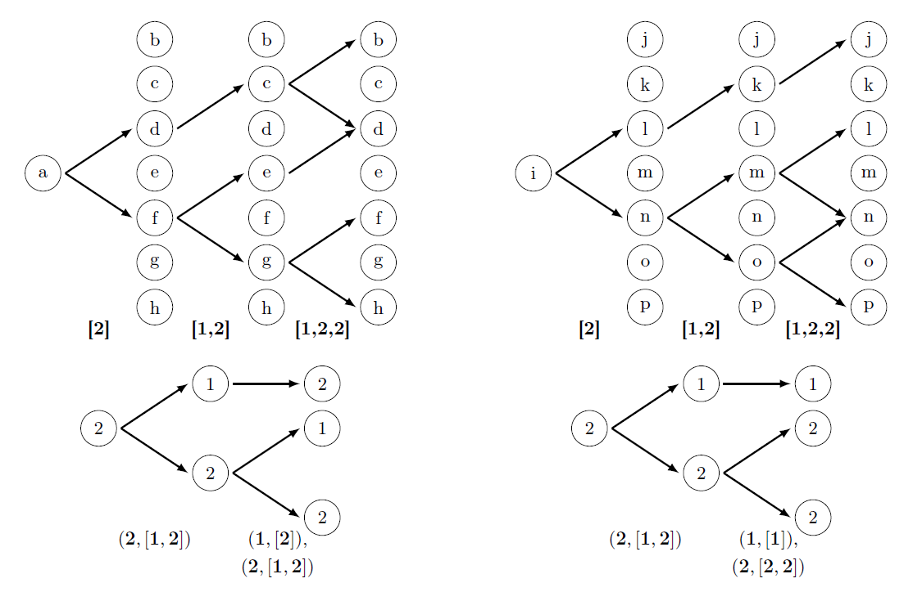

# Graph isomorphism

This package have two basic functions:

1. The `test_isomophism()` function can be used to test graphs for isomorphism. Outputs `True` or `False`.

2. The `find_orbits()` function can be used to find set of isomorphic vertices for each vertex of the graph. For non-symmetric graphs, outputs isomorphism substitution.

Runtime depends polynomially on the number of vertices. In the first case the complexity of the algorithm is $O(n^4)$, in the second case it is $O(n^5)$.

Pseudomultigraphs and directed graphs are supported.

The module has been tested to work on Python 3.12.7.

# Usage

Run examples.py for usage in an interactive session.

```python
>>> g1 = {'1': ['2'],'2': ['1','3'], '3': ['2']}
>>> g2 = {'a': ['b','c'],'b': ['a','c'], 'c': ['a','b'],}
>>> example = Graph(g1,g2)
>>> example.test_isomophism()
False
>>> example1().graph1
{'1': ['2', '3'],
 '2': ['1', '3', '4', '5'],
 '3': ['1', '2', '4', '5'],
 '4': ['2', '3', '5'],
 '5': ['2', '3', '4']}
>>> example1().graph2
{'a': ['b','c'],
 'b': ['a','c','d','e'],
 'c': ['a','b','d','e'],
 'd': ['b','c','e'],
 'e': ['b','c','d']}
>>> example1().test_isomophism()
True
>>> example1().find_orbits()
[('1', 'a'),
 ('2', {'b', 'c'}),
 ('3', {'b', 'c'}),
 ('4', {'d', 'e'}),
 ('5', {'d', 'e'})]
>>>
```

# Symmetry in graphs and automorfism

Symmetry in graphs can be divided into three types:
1. Simple symmetry. The graph has one axes of symmetry. The order of the automorphism group is $\ge2$.
2. Double symmetry. The graph has two axes of symmetry. The order of the automorphism group is $\ge4$.
3. Multiple symmetry. All vertices of the graph lie on the axes of symmetry. The order of the automorphism group is $\ge2*n$, where $n$ is the number of vertices of the graph.


The `find_automorfism()` function can be used to find arbitary automorphism substitution for any symmetry type.

```python
>>> orb = example2().find_orbits()
>>> example2().find_automorfism(orb)
[('a', 'b', 'c', 'd', 'e', 'f'),
 ('f~', 'd~', 'e~', 'b~', 'c~', 'a~')]
>>>
```

# Basic concepts
## Virtual neural network

Virtual neural network is a network focused on working with graphs. In networks of this type, the vertices of the graph are called neurons and the edges of the graph are called synaptic connections. This type of network can be one-way or two-way.

We illustrate the main idea of this design with the following example. 
Let's build two-way virtual neural network for grid 3x3. 
We choose (0,0) and (2,0) as the initial and final coordinates, respectively.
Such the network contains information about all possible paths from point (0,0) to point (2,0) in eight unit steps.
The construction is carried out on both sides, which eliminates the formation of dead-end paths.
For the grid we will have the complexity $O(n^{2.1})$.
In general, the complexity will not exceed $O(n^3)$.

```python
>>> example6().twoway_network(example6().graph1, (0,0), (2,0))
[{(0, 0): [(1, 0), (0, 1)]},
 {(1, 0): [(1, 1)], (0, 1): [(1, 1), (0, 2)]},
 {(1, 1): [(2, 1), (0, 1), (1, 2), (1, 0)], (0, 2): [(1, 2), (0, 1)]},
 {(2, 1): [(1, 1), (2, 2)],
  (0, 1): [(1, 1), (0, 2)],
  (1, 2): [(2, 2), (0, 2), (1, 1)],
  (1, 0): [(1, 1)]},
 {(1, 1): [(2, 1), (0, 1), (1, 2), (1, 0)],
  (2, 2): [(2, 1), (1, 2)],
  (0, 2): [(0, 1), (1, 2)]},
 {(2, 1): [(1, 1), (2, 2)],
  (0, 1): [(1, 1)],
  (1, 2): [(1, 1), (2, 2)],
  (1, 0): [(1, 1)]},
 {(1, 1): [(1, 0), (2, 1)], (2, 2): [(2, 1)]},
 {(1, 0): [(2, 0)], (2, 1): [(2, 0)]}]
>>>
```


## Virtual neural network derivative

Derivative of virtual neural network is called network that is constructed as follows:
1. For each layer, its own list is compiled that consists of the orders of groups (number) of synaptic connections for each neuron. Thus, the sequence of lists consisting of groups orders is obtained.
   
2. Each group order from the lists is associated with the list of groups orders that it generates. For example, writing $(2,[1,2])$ means that the group of order 2 generates two groups of order 1 and 2.

Two graphs are isomorphic if and only if the derivatives of their virtual neural networks constructed from the same vertex coincide.

As an example, consider two one-way virtual neural networks and its derivative.

```python
>>> network1 = example7().oneway_network(example7().graph1,'a',3)
>>> example7().network_derivative(network1)
[[(2, [1, 2])],[(1, [2]), (2, [1, 2])]]
>>> network2 = example7().oneway_network(example7().graph2,'i',3)
>>> example7().network_derivative(network2)
[[(2, [1, 2])],[(1, [1]), (2, [2, 2])]]
>>>
```



## Edge one-way virtual neural network (fast)

When constructing each layer in the network of this type, the edges traversed in all previous layers are not used.

```python
>>> cube().edge_oneway_network(cube().graph1,'a')
[{'a': ['b', 'd', 'e']},
 {'b': ['c', 'f'], 'd': ['c', 'h'], 'e': ['f', 'h']},
 {'c': ['g'], 'f': ['g'], 'h': ['g']}]
>>> cube().test_isomophism(edge=True)
True
>>> iso = cube().find_orbits(edge=True)
>>> cube().find_automorfism(iso)
[('a', 'b', 'c', 'd', 'e', 'f', 'g', 'h'),
('e~', 'f~', 'g~', 'h~', 'a~', 'b~', 'c~', 'd~')]
```


# References

[1] Ronald C. Read, Derek G. Corneil, The Graph Isomorphism Disease, J. Graph Theory, vol. 1, 1977, pp. 339-363.

[2] Johannes Köbler, Uwe Schöning, Jacobo Torán, The Graph Isomorphism Problem: Its Structural Complexity, Springer Science+Business Media, LLC, 1993, 167 p.

[3] László Babai, Graph Isomorphism in Quasipolynomial Time, Preliminary verson, 2015, 84 p., arXiv: 1512.03547

[4] László Babai, Graph Isomorphism in Quasipolynomial Time, Version 2.5, 2018, 109 p., https://people.cs.uchicago.edu/~laci/quasi25.pdf

[5] Steven S. Skiena, The Algorithm Design Manual, Springer, 3nd ed, 2020, 800 p.
